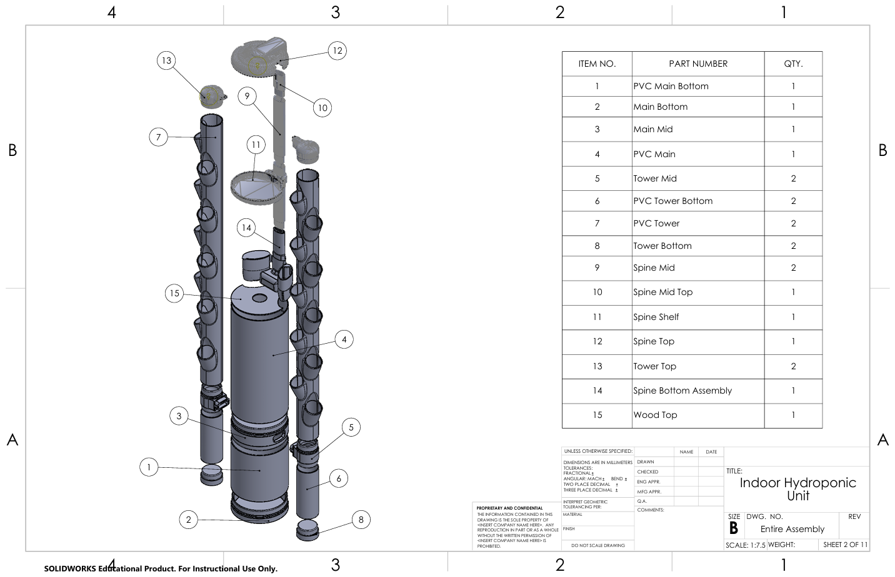
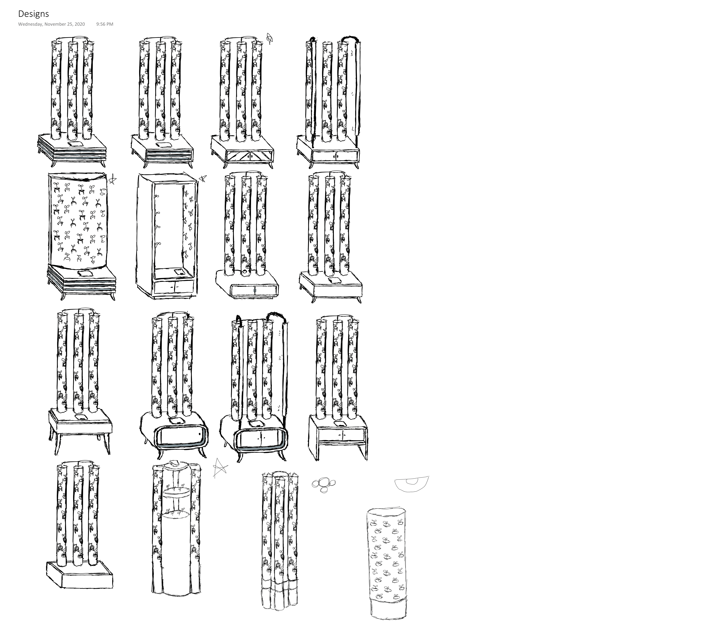

# Modular Vertical Hydroponic Growing System

## Overview

This senior capstone project focused on the design and development of a modular vertical hydroponic growing system for indoor cultivation. The objective was to maximize growing capacity within a compact footprint while emphasizing manufacturability, structural integrity, ease of assembly, and efficient nutrient distribution.

The system was designed using an iterative engineering process that combined CAD modeling, rapid prototyping, and mechanical evaluation. Multiple design iterations were completed to refine component geometry, improve structural performance, simplify assembly, and enhance overall usability.

---

## Design Objectives

* Maximize plant capacity within a compact footprint
* Develop a modular architecture for simplified manufacturing and maintenance
* Design a reliable nutrient delivery and return system
* Minimize assembly complexity and component count
* Create components suitable for additive manufacturing and rapid prototyping

---

## System Overview

The hydroponic system consists of:

* Modular vertical growing towers
* Structural support frame
* Nutrient reservoir
* Water pump and distribution manifold
* Drainage and recirculation system
* Interchangeable growing modules

---

## Mechanical Design

The complete assembly was designed in SolidWorks with an emphasis on product development principles and design for manufacturing.

Major design considerations included:

* Structural stability
* Modular component design
* Packaging efficiency
* Ease of assembly
* Serviceability
* Manufacturability
* Weight reduction

---

## Design Iterations

The system underwent multiple design revisions throughout development.

Engineering improvements focused on:

* Increasing structural rigidity
* Simplifying assembly
* Improving water distribution
* Reducing manufacturing complexity
* Optimizing component geometry
* Enhancing accessibility for maintenance

Each iteration was evaluated and refined through CAD modeling and prototype testing.

---

## Manufacturing & Prototyping

Prototype components were fabricated using rapid prototyping techniques to evaluate assembly, fit, and functionality.

Manufacturing methods included:

* 3D Printing
* Standard mechanical fasteners
* PVC tubing
* Commercially available hardware

Prototype evaluation guided subsequent design revisions and validation.

---

## Water Distribution System

The irrigation system was designed to provide consistent nutrient delivery throughout the vertical growing structure.

Design considerations included:

* Pump selection
* Flow distribution
* Drainage efficiency
* Leak prevention
* Reservoir capacity
* Ease of maintenance

---

## Engineering Challenges

Key engineering challenges included:

* Balancing structural rigidity with material usage
* Maintaining uniform water distribution
* Designing modular, interchangeable components
* Integrating plumbing within a compact footprint
* Improving manufacturability and assembly efficiency

---

## Results

The final design demonstrated:

* Modular construction
* Compact vertical footprint
* Functional nutrient circulation
* Manufacturable component geometry
* Stable structural performance
* Simplified assembly and maintenance

---

## Lessons Learned

This project strengthened experience in:

* Mechanical product design
* CAD assembly development
* Design iteration
* Design for Manufacturing (DFM)
* Rapid prototyping
* Team-based engineering development
* Engineering communication

---

## Technologies Used

### CAD & Design

* SolidWorks
* Blender

### Manufacturing

* 3D Printing
* Rapid Prototyping

### Engineering

* Mechanical Design
* Product Development
* Design for Manufacturing (DFM)
* CAD Modeling
* Fluid System Design
